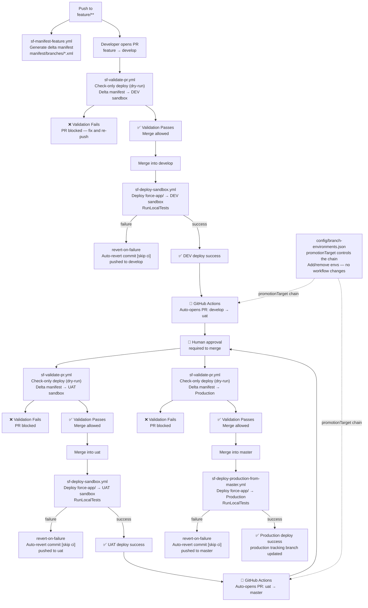

# Salesforce GitHub Deployment Flow

This repository is configured for branch-driven Salesforce deployments with GitHub Actions.

## Deployment Pipeline Overview



## Branching Model

Each sandbox environment has its own branch.

Example:

- `develop` -> DEV sandbox
- `uat` -> UAT sandbox
- `master` -> production deployment source branch
- `production` -> production tracking branch (updated only after successful prod deploy)

Feature workflow:

1. Create feature branch from the source sandbox branch, for example `feature/my-change` from `develop`.
2. Push feature changes. A branch manifest is generated automatically at `manifest/branches/<feature-name>.package.xml`.
3. Open a PR from the feature branch to a target sandbox branch (for example `uat`).
4. PR validation runs a check-only deployment to the target sandbox.
5. If validation succeeds, merge PR.
6. Merge push triggers deployment to that sandbox branch environment.

Production workflow:

1. Push or merge approved changes into `master`.
2. Production workflow deploys from `master` to Production org.
3. If deployment succeeds, workflow updates `production` branch to the deployed commit.

## Configuration

Edit [config/branch-environments.json](config/branch-environments.json). No workflow files need to change.

Authentication policy:

- All environments must use the same `authType`.
- Mixing `sfdx-url` and `jwt` in the same config is blocked by the pipeline.
- For interactive browser login from GitHub UI, use `authType: sfdx-url` for all environments.

Fields:

- `defaultFeatureBaseBranch`: branch used to compute feature branch manifest delta.
- `environments`: map of branch name to sandbox deployment target.
  - `name`: label for environment.
  - `authType`: `sfdx-url` or `jwt`.
  - `authSecret`: GitHub secret name containing SFDX auth URL (used for `sfdx-url`).
  - `jwtClientIdSecret`: GitHub secret name containing Connected App consumer key (used for `jwt`).
  - `jwtUsernameSecret`: GitHub secret name containing Salesforce username (used for `jwt`).
  - `jwtPrivateKeySecret`: GitHub secret name containing RSA private key PEM (used for `jwt`).
  - `jwtLoginUrl`: Salesforce login URL for JWT auth, for example `https://login.salesforce.com` or `https://test.salesforce.com`.
  - `testLevel`: Salesforce test level for deploy/validate.
  - `promotionTarget`: branch that receives the auto-promotion PR after a successful deploy.
- `production`: production deployment settings.
	- `sourceBranch`: branch that triggers production deploy (default `master`).
	- `trackingBranch`: branch updated after successful production deploy (default `production`).
  - same auth fields as sandbox environments (`authType`, `authSecret`, `jwt*`, `jwtLoginUrl`).

### Field reference

| Field | Effect |
|---|---|
| `environments` key | Which Git branch triggers a deploy to that org |
| `name` | Display label in logs and PR titles |
| `authType` | `sfdx-url` or `jwt` (must be consistent across all environments) |
| `authSecret` | Secret name for SFDX auth URL (used for `sfdx-url`) |
| `jwtClientIdSecret` | Secret name for Connected App consumer key |
| `jwtUsernameSecret` | Secret name for Salesforce username |
| `jwtPrivateKeySecret` | Secret name for RSA private key PEM |
| `jwtLoginUrl` | Login URL used for JWT auth |
| `testLevel` | `RunLocalTests`, `RunAllTestsInOrg`, or `NoTestRun` |
| `promotionTarget` | Which branch gets the auto-promotion PR after a successful deploy |
| `production.sourceBranch` | Which branch triggers the production deploy workflow |
| `production.trackingBranch` | Which branch is updated after a successful production deploy |

## Adding an Environment

1. Add a new key under `environments` in [config/branch-environments.json](config/branch-environments.json). The key **must match the Git branch name exactly**.
2. Update `promotionTarget` on the environment below it to point to the new branch, and set the new environment's `promotionTarget` to point onward.
3. Create the branch in Git.
4. Store the org auth from the GitHub UI — see [Interactive Browser Authentication From GitHub](#interactive-browser-authentication-from-github).

Example — inserting a `staging` environment between `uat` and `master`:

```json
"uat": {
  "name": "UAT_SANDBOX",
  "authType": "sfdx-url",
  "authSecret": "SF_AUTH_URL_UAT",
  "testLevel": "RunLocalTests",
  "promotionTarget": "staging"
},
"staging": {
  "name": "STAGING_SANDBOX",
  "authType": "sfdx-url",
  "authSecret": "SF_AUTH_URL_STAGING",
  "testLevel": "RunLocalTests",
  "promotionTarget": "master"
}
```

## Removing an Environment

1. Delete its entry from `environments`.
2. Update the `promotionTarget` of the environment above it to skip the removed one.
3. Delete the Git branch if no longer needed.

Example — removing `uat` from a three-environment chain:

```json
"develop": {
  ...
  "promotionTarget": "master"
}
```

## Changing the Promotion Order

Only change `promotionTarget` values. Example — reordering to `develop → staging → uat → master`:

```json
"develop":  { "promotionTarget": "staging" },
"staging":  { "promotionTarget": "uat" },
"uat":      { "promotionTarget": "master" }
```

## Required GitHub Secrets

Create these repository secrets (or rename in config):

- For `sfdx-url` mode:
  - `SF_AUTH_URL_DEV`
  - `SF_AUTH_URL_UAT`
  - `SF_AUTH_URL_PROD`
- For `jwt` mode:
  - `<ENV>_JWT_CLIENT_ID`
  - `<ENV>_JWT_USERNAME`
  - `<ENV>_JWT_PRIVATE_KEY`

## Interactive Browser Authentication From GitHub

Use [sf-auth-interactive-broker.yml](.github/workflows/sf-auth-interactive-broker.yml) when you want Salesforce CLI style browser login initiated from GitHub UI.

How it works:

1. Admin runs workflow from Actions tab and enters branch + instance URL.
2. Workflow calls your auth broker and prints an `authorizeUrl` in the run summary.
3. Admin opens link, logs in with Salesforce user, completes consent.
4. Workflow polls broker until complete, receives `sfdxAuthUrl`, and stores it in the mapped GitHub secret.
5. Workflow verifies login immediately.

Required repository secrets for broker integration:

- `SF_AUTH_BROKER_BASE_URL`
- `SF_AUTH_BROKER_API_TOKEN`
- `GH_SECRETS_PAT` (repo secrets write permission)

This gives browser-based auth managed from GitHub without local CLI commands for admins.

## Workflows Added

- [Salesforce Feature Manifest](.github/workflows/sf-manifest-feature.yml)
	- Trigger: push to `feature/**`
	- Output: branch-specific manifest in `manifest/branches/`
- [Salesforce PR Validation](.github/workflows/sf-validate-pr.yml)
	- Trigger: pull requests
	- Behavior: check-only deploy to org mapped from PR base branch
- [Salesforce Sandbox Deployment](.github/workflows/sf-deploy-sandbox.yml)
	- Trigger: push/merge to any branch
	- Behavior: deploys only if branch exists in `environments`; **auto-reverts on failure**
- [Salesforce Production Deployment](.github/workflows/sf-deploy-production-from-master.yml)
	- Trigger: push/merge to `master`
	- Behavior: deploy to prod, update production tracking branch; **auto-reverts on failure**
- [Salesforce Org Auth Check](.github/workflows/sf-auth-org.yml)
    - Trigger: manual (`workflow_dispatch`)
    - Behavior: resolves target org from config, authenticates with mapped secret, prints org session details
- [Salesforce Interactive Org Auth](.github/workflows/sf-auth-interactive-broker.yml)
  - Trigger: manual (`workflow_dispatch`)
  - Behavior: starts browser login via auth broker, stores resulting SFDX auth URL in mapped GitHub secret

## Manual Org Authentication Workflow

Use [sf-auth-org.yml](.github/workflows/sf-auth-org.yml) when you want to verify org authentication independently of deployments.

How to run:

1. Open **GitHub → Actions → Salesforce Org Auth Check → Run workflow**.
2. Choose `mode`:
    - `sandbox`: resolves from `environments` in `config/branch-environments.json`.
    - `production`: resolves from `production` in `config/branch-environments.json`.
3. Enter `branch`:
    - examples: `develop`, `uat`, `master`
4. Run workflow.

Expected behavior:

- If mapping exists and secret is configured, authentication succeeds and `sf org display --verbose` is shown in logs.
- If mapping is missing, workflow fails with a clear message.
- If secret is missing/empty, workflow fails with a clear message.

## Auto-Revert on Deployment Failure

When a merge into an environment branch (e.g. `develop`, `uat`, `master`) triggers a deployment that **fails**, the pipeline automatically pushes a revert commit back to that branch. The revert commit message includes `[skip ci]` so it does not trigger another deploy run.

This keeps the environment branch in a deployable state at all times. Developers must fix the issue on the feature branch and open a new PR.

### How the revert works

1. PR is merged into `develop` → push event fires → `sf-deploy-sandbox.yml` runs.
2. `sf project deploy start` fails (test failure, validation error, etc.).
3. `revert-on-failure` job runs.
4. It detects whether HEAD is a merge commit or a squash commit and runs the appropriate `git revert`.
5. Pushes `revert: auto-rollback — deployment to DEV_SANDBOX failed [skip ci]` to `develop`.

### Branch Protection Requirements for Auto-Revert

The revert job pushes directly to the protected environment branch using the `GITHUB_TOKEN`. For this to succeed you **must** configure branch protection on each environment branch:

1. Go to **Repository Settings → Branches → Branch protection rules**.
2. Select the rule for the environment branch (e.g. `develop`).
3. Under **"Allow specified actors to bypass required pull requests"**, add **GitHub Actions** (or `github-actions[bot]`).

Without this, the revert push will fail with a 403 error, and the branch will remain in the broken state until manually reverted.

## Branch Protection Recommendations

Set required checks before merge to catch failures *before* they land on an environment branch:

- Require [Salesforce PR Validation](.github/workflows/sf-validate-pr.yml) as a required status check on all environment branches (`develop`, `uat`, `master`).
- Require at least one review approval.
- Restrict direct pushes to environment branches — only merges via PRs should be allowed.
- Allow the `github-actions[bot]` to bypass push restrictions (required for auto-revert).

## Local Utility Scripts

- `npm run manifest:branch -- --base origin/develop --head HEAD --branch feature/my-change --output manifest/branches/feature-my-change.package.xml`
- `npm run ci:resolve-target -- sandbox uat`

## Notes

- Deploy workflows install Salesforce CLI dynamically in GitHub runners.
- Validation uses manifest delta; branch deployments use full source (`force-app`) for consistency.
